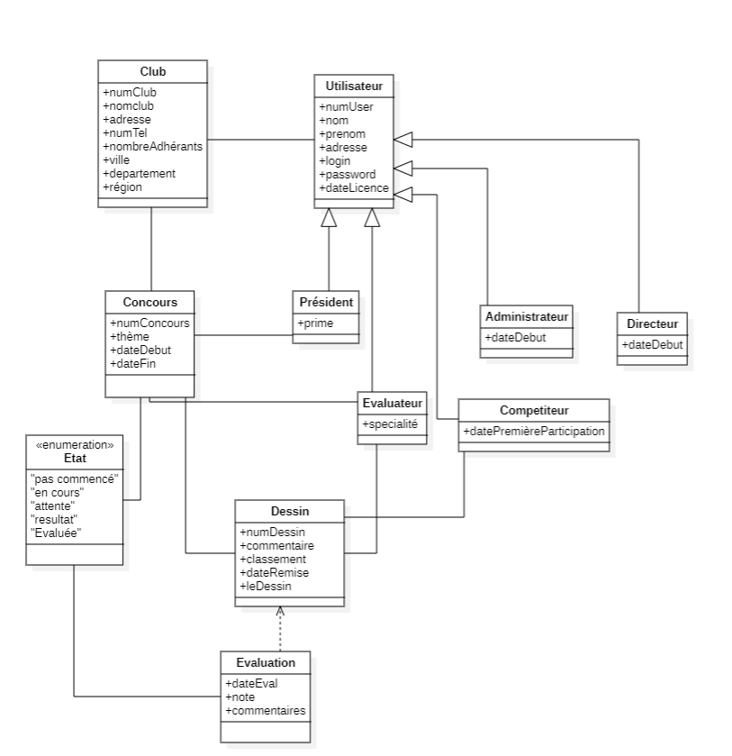

[//]: <> (Version du readme: 4.3)
# SketchOnline

[](Documentation/readme/logo.png)

[](LICENSE.md)
[](https://github.com/guillaume-rce/SketchOnline)

## Testez le projet

### Site web
[**Accès au site web**](http://20.39.244.13:1956/SketchOnline/Frontend/Pages/index.html)

Identifiants de test:
- **Administrateur:**
    - **Identifiant:** integerurna@yahoo.com
    - **Mot de passe:** Clb15
- **Président:**
    - **Identifiant:** aenean.eget@gmail.com
    - **Mot de passe:** Clb2
- **Directeur:**
    - **Identifiant:** sed.dictum@gmail.com
    - **Mot de passe:** Clb2
- **Évaluateur:**
    - **Identifiant:** eros.nec@gmail.com
    - **Mot de passe:** Clb1
- **Membre:**
    - **Identifiant:** dapibus@protonmail.com
    - **Mot de passe:** Clb1
    
### Fichiers de test

Executer la commande suivante pour lancer le script de test:
```bash
./launch-code.sh
```

## Spécifications du projet 

### Vue d'ensemble
- **Objectif :** Développer un système d'information pour la gestion de concours de dessins.
- **Cible :** Clubs de dessin.

### Clubs
- Identifiés par plusieurs informations dont le nombre de membres et la localisation.

### Concours
- **Fréquence :** 4 par an.
- **Identification :** Numéro unique, thème, description, dates.
- **Soumissions :** Limitées à la durée du concours.
- **Classement :** Post-concours.

### Rôles des Utilisateurs
- **Administrateur :** Crée les concours.
- **Président :** Supervise le concours.
- **Membres :** Peuvent être compétiteurs ou évaluateurs.
- **Directeurs de club :** Accèdent à toutes les informations.

### États du Concours
1. Non commencé.
2. En cours.
3. En attente de résultats.
4. Évalué.

### Fonctionnalités de la Plateforme
- Mises à jour automatiques.
- Les utilisateurs authentifiés peuvent voir tous les résultats.
- Inscription de nouveaux membres non gérée par la plateforme.
- Participation des clubs sous conditions.

### Gestion des Données
- **Dessins :** ID unique, commentaires, classement.
- **Évaluations :** Commentaires, note.
- **Utilisateurs :** ID unique, informations personnelles.
- **Fonctionnalités supplémentaires :** Suggestions bienvenues.

## Fonctionnalités du projet

- Systeme de login et de register
- Systeme de déconnexion
- Systeme de gestion des roles
- Affichage des concours avec les informations de base
- Affichage des dessins évalués et liker
- Systeme de soumission de dessin
- Systeme d'ajout de concours

## Diagramme conceptuel



---

### Arborescence du projet

```bash
SketchOnline/
├── Backend
│   ├── competitions.php
│   ├── configdb.php
│   ├── create
│   │   ├── addAdministrateur.php
│   │   ├── addCompetiteur.php
│   │   ├── addDirecteur.php
│   │   ├── addEvaluateur.php
│   │   ├── addParticipationClub.php
│   │   ├── addParticipationCompetiteur.php
│   │   ├── addPresident.php
│   │   ├── createClub.php
│   │   ├── createConcours.php
│   │   ├── createDessin.php
│   │   ├── createEvaluation.php
│   │   ├── createJury.php
│   │   ├── createUtilisateur.php
│   │   ├── getPresidents.php
│   │   └── upload.php
│   ├── create_bdd.php
│   ├── createConcours.php
│   ├── evaluate.php
│   ├── evaluations.php
│   ├── evaluator.php
│   ├── event.php
│   ├── gallery.php
│   ├── getRole.php
│   ├── login.php
│   ├── profile.php
│   ├── register.php
│   ├── role.php
│   ├── submission.php
│   └── test.php
├── Database
│   └── SQL_Scripts
│       ├── create_tables.sql
│       └── Utilisateurs.sql
├── Documentation
│   ├── CahierDesCharges.pdf
│   ├── logo.svg
│   └── readme
│       ├── diagramme.png
│       └── logo.png
├── Frontend
│   ├── assets
│   │   ├── default_profile_image.jpg
│   │   ├── home_bg.png
│   │   ├── login_register_bg.png
│   │   └── logo.svg
│   ├── Pages
│   │   ├── 404.html
│   │   ├── administrator.html
│   │   ├── competition.html
│   │   ├── competitor.html
│   │   ├── director.html
│   │   ├── evaluator.html
│   │   ├── event.html
│   │   ├── eventlog.html
│   │   ├── gallery.html
│   │   ├── index.html
│   │   ├── indexlog.html
│   │   ├── login.html
│   │   ├── president.html
│   │   └── register.html
│   ├── Scripts
│   │   ├── administrator.js
│   │   ├── AutoRedirect
│   │   │   ├── autoRedirectEvent.js
│   │   │   └── autoRedirectIndex.js
│   │   ├── competition.js
│   │   ├── competitor.js
│   │   ├── director.js
│   │   ├── evaluator.js
│   │   ├── event.js
│   │   ├── gallery.js
│   │   ├── index.js
│   │   ├── login.js
│   │   ├── president.js
│   │   ├── redirectevent.js
│   │   ├── redirectgallery.js
│   │   ├── redirectToMy.js
│   │   └── register.js
│   ├── service
│   │   └── api.js
│   └── Styles
│       ├── 404.css
│       ├── administrator.css
│       ├── competition.css
│       ├── competitor.css
│       ├── director.css
│       ├── evaluator.css
│       ├── event.css
│       ├── gallery.css
│       ├── index.css
│       ├── login.css
│       ├── president.css
│       ├── register.css
│       └── style.css
├── launch-code.sh
├── package.json
├── README.md
├── Uploads
│   ├── Contest
│   │   ├── 401
│   │   │   ├── 401.png
│   │   │   └── Drawing
│   │   ├── 402
│   │   │   ├── 402.png
│   │   │   └── Drawing
│   │   │       └── 3.png
│   │   ├── 403
│   │   │   ├── 403.png
│   │   │   └── Drawing
│   │   │       └── 7.png
│   │   ├── 404
│   │   │   └── 404.png
│   │   ├── 405
│   │   │   └── 405.png
│   │   ├── 406
│   │   │   ├── 406.png
│   │   │   └── drawing
│   │   ├── 407
│   │   │   ├── 407.png
│   │   │   └── Drawing
│   │   │       └── 6.png
│   │   ├── 408
│   │   │   └── 408.png
│   │   └── 409
│   │       ├── 409.png
│   │       └── Drawing
│   │           └── 23.png
│   └── Drawing
│       ├── 401.png
│       ├── 404.png
│       ├── 5.png
│       ├── 6.png
│       ├── 7.png
│       └── 8.png
└── vm-SteveNoumi_key.pem
```

### Structure et Fonctionnalités du Projet

#### Backend
Le backend de `SketchOnline` est développé en PHP et joue un rôle crucial dans la gestion des données et des fonctionnalités du site.

- **`competitions.php`**: Gère les informations relatives aux concours, telles que la création, la mise à jour et la récupération des détails des concours.
- **`createConcours.php`**: Script spécifique pour la création de nouveaux concours.
- **`create_bdd.php`**: Utilisé pour initialiser et configurer la base de données du projet.
- **`configdb.php`**: Fichier de configuration de la base de données, contenant les paramètres de connexion.
- *Plusieurs autres scripts* gèrent divers aspects de la fonctionnalité backend, incluant la sécurité, la gestion des utilisateurs, etc.

#### Base de Données
Le dossier `Database` comprend des scripts SQL essentiels pour la structure de la base de données.

- **`SQL_Scripts`**: Contient les scripts pour créer et maintenir les structures de la base de données, comme les tables pour les utilisateurs, les clubs, et les concours.

##### Précision sur le script SQL

1. **Objectif** : Ce script SQL est conçu pour peupler une base de données, nommée `SketchOnlineDatabase`, avec des données initiales.

2. **Contenu** :
   - **Base de données ciblée** : Le script commence par sélectionner la base de données à utiliser avec la commande `USE SketchOnlineDatabase;`.
   - **Insertion de données dans la table `Club`** : Plusieurs instructions `INSERT INTO` sont utilisées pour ajouter des données dans la table `Club`. Chaque insertion spécifie des valeurs pour les colonnes `numClub`, `nomClub`, `adresse`, `numTelephone`, `nombreAdherants`, `ville`, `departement`, et `region`.

3. **Exemple d'insertion** : 
   - `INSERT INTO Club (...) VALUES (701, 'Les Créatifs Pinceaux', '123 Rue Principale', '0123456789', 20, 'Angers', 'Maine-et-Loire', 'Pays de la Loire');`
   - Cette commande insère un enregistrement pour un club nommé 'Les Créatifs Pinceaux' situé à Angers.

#### Documentation
Des documents importants pour comprendre et gérer le projet.

- **`CahierDesCharges.pdf`**: Détaille les exigences et les spécifications du projet.
- **`logo.svg`**: Le logo officiel de SketchOnline utilisé dans l'interface utilisateur et le matériel promotionnel.

#### Frontend
Le frontend est structuré de manière à offrir une expérience utilisateur fluide et intuitive.

- **`assets`**: Contient des ressources graphiques, telles que les images de fond et les logos.
- **`Pages`**: Inclut les fichiers HTML pour chaque page du site, comme la page d'accueil, la page de connexion, la galerie, etc.
- **`Scripts`**: Scripts JavaScript pour ajouter une interactivité client-side, comme les validations de formulaires et les interactions dynamiques.
- **`Styles`**: Fichiers CSS pour le style et la mise en page du site. Chaque page a son propre fichier CSS correspondant.

## Contributions

### Équipe

- **Steve Darius NDE NOUMI** - *Développeur Backend* - [Acces profil](https://github.com/stevenoumi)
- **Guillaume ROCHE** - *Développeur Frontend* - [Acces profil](https://github.com/GuillaumeROCHE49)
- **Clemence MAIGNAN** - *Definition du projet et remplissage de la base de données* - [Acces profil](https://github.com/Sapph49)
- **Milaine Miriam DAMKAM** - *Definition du projet et definition des articles* - [Acces profil](https://github.com/MilaineMiriam)

### Contributeurs

- **M. HAMMOUDI Slimane** - *Professeur*
- **Mme. ABDALLAH  Maïssa** - *Professeur*